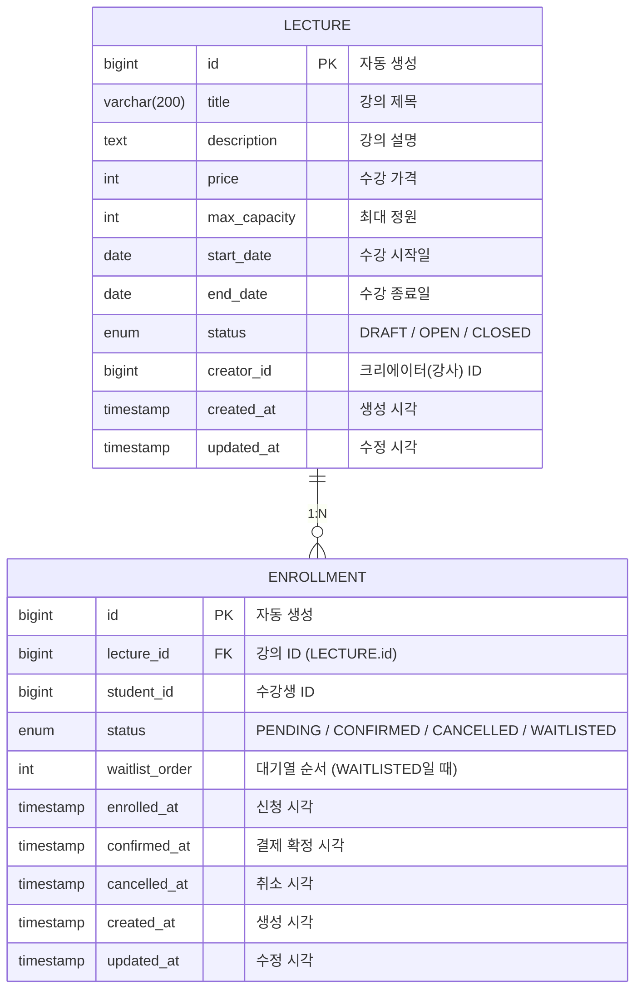
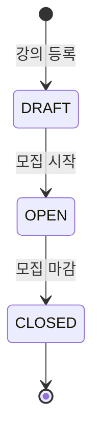
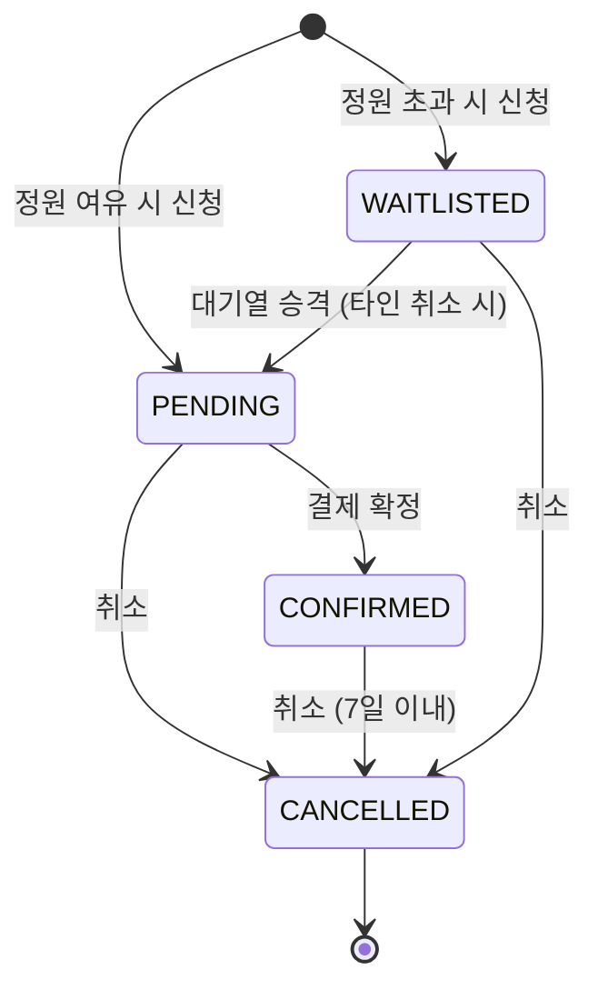

# DB 스키마 & ERD

## ERD (Entity Relationship Diagram)



---

## 테이블 상세

### LECTURE (강의)

| 컬럼 | 타입 | 제약조건 | 설명 |
|------|------|----------|------|
| `id` | BIGINT | PK, AUTO_INCREMENT | 강의 고유 ID |
| `title` | VARCHAR(200) | NOT NULL | 강의 제목 |
| `description` | TEXT | - | 강의 상세 설명 |
| `price` | INTEGER | NOT NULL | 수강 가격 (원) |
| `max_capacity` | INTEGER | NOT NULL | 최대 수강 정원 |
| `start_date` | DATE | NOT NULL | 수강 시작일 |
| `end_date` | DATE | NOT NULL | 수강 종료일 |
| `status` | ENUM | NOT NULL | 강의 상태 |
| `creator_id` | BIGINT | NOT NULL | 크리에이터(강사) ID |
| `created_at` | TIMESTAMP(6) | NOT NULL | 생성 시각 (자동) |
| `updated_at` | TIMESTAMP(6) | NOT NULL | 수정 시각 (자동) |

**강의 상태 (status)**:

| 값 | 설명 | 수강 신청 |
|----|------|----------|
| `DRAFT` | 초안 | ❌ 불가 |
| `OPEN` | 모집 중 | ✅ 가능 |
| `CLOSED` | 모집 마감 | ❌ 불가 |

**상태 전환**: `DRAFT` → `OPEN` → `CLOSED` (단방향, 역방향 불가)

---

### ENROLLMENT (수강 신청)

| 컬럼 | 타입 | 제약조건 | 설명 |
|------|------|----------|------|
| `id` | BIGINT | PK, AUTO_INCREMENT | 수강 신청 고유 ID |
| `lecture_id` | BIGINT | FK, NOT NULL | 강의 ID (LECTURE.id 참조) |
| `student_id` | BIGINT | NOT NULL | 수강생 ID |
| `status` | ENUM | NOT NULL | 신청 상태 |
| `waitlist_order` | INTEGER | NULLABLE | 대기열 순서 (WAITLISTED일 때만 사용) |
| `enrolled_at` | TIMESTAMP(6) | NULLABLE | 신청 시각 |
| `confirmed_at` | TIMESTAMP(6) | NULLABLE | 결제 확정 시각 |
| `cancelled_at` | TIMESTAMP(6) | NULLABLE | 취소 시각 |
| `created_at` | TIMESTAMP(6) | NOT NULL | 생성 시각 (자동) |
| `updated_at` | TIMESTAMP(6) | NOT NULL | 수정 시각 (자동) |

**Foreign Key**: `enrollment.lecture_id` → `lecture.id`

**신청 상태 (status)**:

| 값 | 설명 | 정원 카운트 |
|----|------|-----------|
| `PENDING` | 신청 완료, 결제 대기 | ✅ 포함 |
| `CONFIRMED` | 결제 완료, 수강 확정 | ✅ 포함 |
| `WAITLISTED` | 정원 초과, 대기열 등록 | ❌ 미포함 |
| `CANCELLED` | 취소됨 | ❌ 미포함 |

---

## 상태 전환 다이어그램

### 강의 상태



### 수강 신청 상태



---

## 동시성 제어

### 비관적 락 (Pessimistic Lock)

수강 신청 시 정원 체크를 위해 `LECTURE` 테이블에 비관적 락을 적용합니다:

```sql
-- 수강 신청 시 강의 row를 잠금
SELECT * FROM LECTURE WHERE id = ? FOR UPDATE
```

이를 통해 동시에 여러 사용자가 마지막 자리에 신청하는 경우의 race condition을 방지합니다.

### 정원 카운트 쿼리

```sql
-- 활성 신청 인원 카운트 (PENDING + CONFIRMED)
SELECT COUNT(*) FROM ENROLLMENT
WHERE lecture_id = ?
AND status IN ('PENDING', 'CONFIRMED')
```

---

## 인덱스

JPA/Hibernate가 자동 생성하는 인덱스:
- `LECTURE.id` — Primary Key Index
- `ENROLLMENT.id` — Primary Key Index
- `ENROLLMENT.lecture_id` — Foreign Key Index

추가 권장 인덱스 (대규모 데이터 시):
```sql
CREATE INDEX idx_enrollment_student_id ON ENROLLMENT(student_id);
CREATE INDEX idx_enrollment_status ON ENROLLMENT(lecture_id, status);
CREATE INDEX idx_lecture_status ON LECTURE(status);
```
